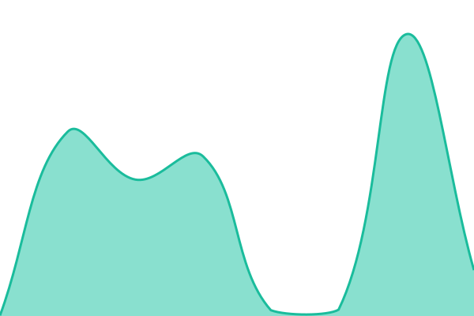
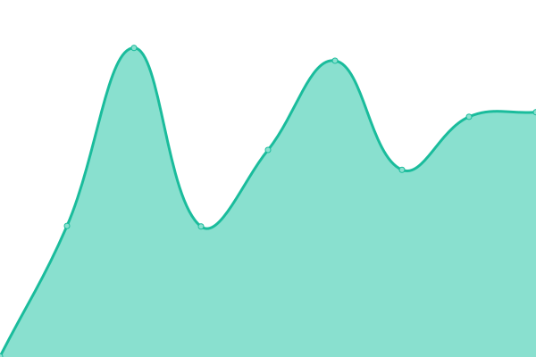
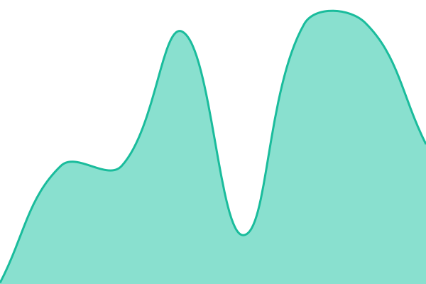
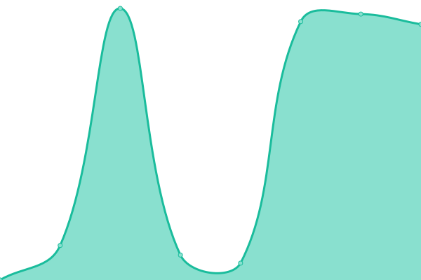

# [📈 Live Status](https://dominion-it.github.io/upptime): <!--live status--> **🟧 Partial outage**

This repository contains the open-source uptime monitor and status page for [Dominion Systems Uptime](https://dominion-it.github.io/uptime), powered by [Upptime](https://github.com/upptime/upptime).

<!--start: status pages-->
<!-- This summary is generated by Upptime (https://github.com/upptime/upptime) -->
<!-- Do not edit this manually, your changes will be overwritten -->
<!-- prettier-ignore -->
| URL | Status | History | Response Time | Uptime |
| --- | ------ | ------- | ------------- | ------ |
|  [Payroll (Live)](https://live.dominionsystems.com/Payroll/applicantPostingListNL.aspx?code=time) | 🟩 Up | [payroll-live.yml](https://github.com/dominionsystems/uptime/commits/HEAD/history/payroll-live.yml) | 

 592ms
     
 | 

<a href="https://dominionsystems.github.io/uptime/history/payroll-live">100.00%</a>
    

|  [Payroll (2Live)](https://2live.dominionsystems.com/Payroll/applicantPostingListNL.aspx?code=time) | 🟩 Up | [payroll-2-live.yml](https://github.com/dominionsystems/uptime/commits/HEAD/history/payroll-2-live.yml) | 

 619ms
     
 | 

<a href="https://dominionsystems.github.io/uptime/history/payroll-2-live">100.00%</a>
    

|  [Punch Monitor](https://live.dominionsystems.com/punchmonitor/readpunches.aspx) | 🟥 Down | [punch-monitor.yml](https://github.com/dominionsystems/uptime/commits/HEAD/history/punch-monitor.yml) | 

 199ms
     
 | 

<a href="https://dominionsystems.github.io/uptime/history/punch-monitor">0.00%</a>
    

|  [Mobile Authentication Server](https://auth2.dominionsystems.com/v4/.well-known/openid-configuration) | 🟩 Up | [mobile-authentication-server.yml](https://github.com/dominionsystems/uptime/commits/HEAD/history/mobile-authentication-server.yml) | 

 373ms
     
 | 

<a href="https://dominionsystems.github.io/uptime/history/mobile-authentication-server">100.00%</a>
    

|  [Authentication Server](https://auth2.dominionsystems.com/issue/wsfed) | 🟩 Up | [authentication-server.yml](https://github.com/dominionsystems/uptime/commits/HEAD/history/authentication-server.yml) | 

 576ms
     
 | 

<a href="https://dominionsystems.github.io/uptime/history/authentication-server">100.00%</a>
    

|  [Mobile API (azure)](https://dsmobileapi.azurewebsites.net/api/clock) | 🟩 Up | [mobile-api-azure.yml](https://github.com/dominionsystems/uptime/commits/HEAD/history/mobile-api-azure.yml) | 

 104ms
     
 | 

<a href="https://dominionsystems.github.io/uptime/history/mobile-api-azure">100.00%</a>
    

|  [Mobile API (dom-services)](https://services.dominionsystems.com/mobile/api/clock) | 🟩 Up | [mobile-api-dom-services.yml](https://github.com/dominionsystems/uptime/commits/HEAD/history/mobile-api-dom-services.yml) | 

 3811ms
     
 | 

<a href="https://dominionsystems.github.io/uptime/history/mobile-api-dom-services">100.00%</a>
    

|  [2Mobile API (azure)](https://dsmobile2api.azurewebsites.net/api/clock) | 🟩 Up | [2-mobile-api-azure.yml](https://github.com/dominionsystems/uptime/commits/HEAD/history/2-mobile-api-azure.yml) | 

 101ms
     
 | 

<a href="https://dominionsystems.github.io/uptime/history/2-mobile-api-azure">100.00%</a>
    

<!--end: status pages-->

[**Visit our status website →**](https://dominion-it.github.io/uptime/)

## 📄 License

- Code: [MIT](./LICENSE) © [Upptime](https://upptime.js.org)
- Data in the `./history` directory: [Open Database License](https://opendatacommons.org/licenses/odbl/1-0/)
